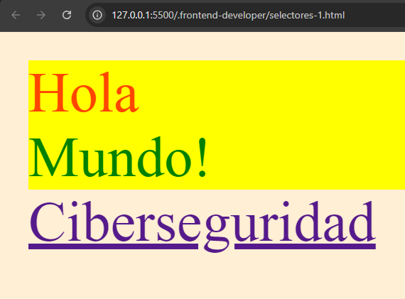
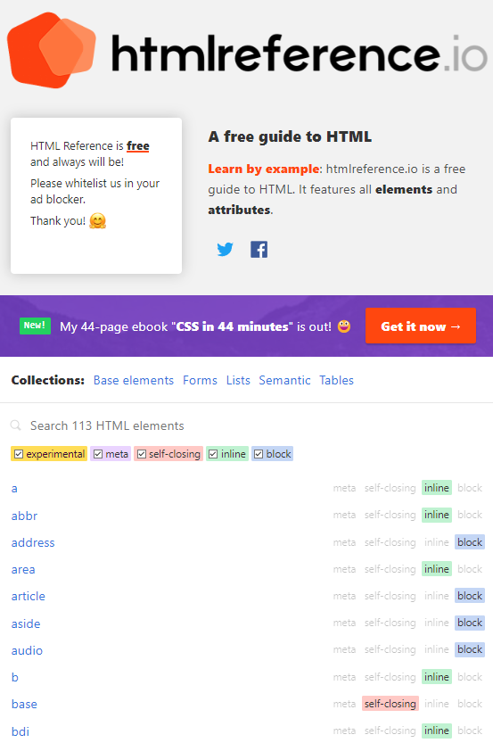

# Maquetación CSS

<br>

## 1. Anatomía de una declaración CSS

Se coloca el nombre del `selector`, entre llaves escribimos la `propiedad` seguido del `valor` y al final punto y coma `;`

En el ejemplo, `h1` es el **selector**, entre las llaves, `color` es la **propiedad** y `green` es el **valor** asignado a la propiedad.

```css
h1 {
    color: green;
}
```

<br>
<br>

## 2. Selectores Básicos

Existen varias formas de agregar estilo a los fichero html mediante los selectores de css, y son los siguientes:

|   |  |
| :---: | :---: |
| De tipo | div{...} |
| De clase | .elemento {...} |
| De ID | #id-del-elemento |
| De atributo | a [href="..."]{...} | 
| Universal | *{...} |

<br>

- **De tipo**: Se coloca el nombre de la `etiqueta`, y todos las etuiquetas de ese tipo serán modificadas en el fichero html.  
- **De clase**: Colocamos un punto `(.)` y el nombre del elemento `(clase)`, nos modificará toda aquella etiqueta con la misma clase.
- **De ID**: Se coloca un gato `(#)`(almohadilla, hashtag, numeral, etc. cada lugar lo nombra diferente), seguido del ID del elemento.
- **De atributo**: Haciendo alusión al atributo de alguna etiqueta.
- **Universal**: Se escribe con un asterisco `(*)` y modificará todo en el documento.

<br>

```css 
        *{                                  /* Selector Universal (*) */
            background: papayawhip;             
        }
        div {                               /* Selector de tipo */
            background: yellow;
        }
        .titulo {                           /* Selector de clase */
            color : orangered;
        }
        #titulo2 {                          /* Selector de iD */
            color: green;
        }
        a [href="https://platzi.com/ruta/especialista-ciberseguridad/?school=_escuela_ciberseguridad_"]{     
            color: pink;                    /* Selector de atributo */
        }
       
```

Aquí tenemos unos enlaces de referencia para la comprensión de los selectores y los códigos y nombres de colores de html  
[Códigos y nombres de colores](https://htmlcolorcodes.com/es/)  
[Código CSS de platzi de los selectores](https://github.com/platzi/curso-frontend-developer/blob/5108689bdb6599cc92bd9595db28784f9be48704/curso-1/selectores-2.html)

<br>

### 3. Maquetación de selectores básicos:

```html
<!DOCTYPE html>
<html lang="en">
<head>
    <meta charset="UTF-8">
    <meta name="viewport" content="width=device-width, initial-scale=1.0">
    <title>Document</title>
    <style>
        div {
            background: yellow;
            ;
        }
        .titulo {
            color : orangered;
        }
        #titulo2 {
            color: green;
        }
        a [href="https://platzi.com/ruta/especialista-ciberseguridad/?school=_escuela_ciberseguridad_"]{
            color: pink;
        }
        * {
            background: papayawhip;
        }
    </style>
</head>
<body>
    <div class = "titulo">Hola</div> 
    <div id = "titulo2">Mundo!</div>
    <a href="https://platzi.com/ruta/especialista-ciberseguridad/?school=_escuela_ciberseguridad_">Ciberseguridad</a>
</body>
</html>
```

<br>

En el navegador se vería así:



<br>
<br>

## 4. Selectores combinadores.

Es posible combinar los selectores para agregar estilos de manera mas especifica, existen distintos tipos:

<br>

|  |  |
| :---: | :---: |
| Descendientes | div p |
| Hijo directo | div > p |
| Elemento adyacente | div + p |
| General de hermanos | div ~ p |

<br>

- **Descendientes**: Todos los elementos de un solo tipo contenidos en otro se modificarán, se escribe el `elemento padre`, `espacio`, y el `elemento descendiente` que será de manera general, en el ejemplo de abajo, todas las etiquetas p, tendrán letras de color rojo.
  
  <br>

  ```css
  div p {
    color: red;
  }
  ```
  ```html
  <div>
    <p>letras color rojo</p>
    <p>letras color rojo</p>
    <p>letras color rojo</p>
  </div>
  ```

<br>
<br>

- **Hijo directo**: El elemento hijo que esta justo por debajo del elemento padre será modificado, se escribe el `elemento padre` seguido de un signo de **mayor que** `(>)` y el `elemento hijo directo`. En el ejemplo tenemos 3 div anidados el div hijo que esta justo por debajo del div padre es el que tendrá el background de color azul.
  
  <br>

  ```css
  div > div {
    background: blue;
  }
  ```
  ```html
  <div>
        <div>
            <p>Aquí todo el div padre</p>
            <p>tendrá un background</p>
            <p>de color azul</p>
            <div class="es">Meow asi es.</div>
        </div>
    </div>
  ```

  <br>
  <br>

- **Elemento adyacente**: Será modificado el `elemento que este junto` al `elemento que escribamos primero` en el selector, en medio de estos dos escribiremos el **signo de mas** `(+)`. En el siguiente ejemplo todos los elementos **section** que esten seguidos de un elemnto **div** tendrán el background verde:
    
  <br>

  ```css
  div + section {
    color: green;
  }
  ```
  ```html
  <div>
    <p></p>
  </div>
  <section> Esta sección tendrá el background de color verde </section>
  <div>
    <p></p>
  </div>
  <section> Esta sección también tendrá el background de color verde</section>
  <footer></footer>
  ```

  <br>
  <br>

- **Elemento General de hermanos**: modifica a los `hermandos del primer selector escrito`, en medio de estos se escribe una **virgulilla** `(~)`. En este ejemplo, todos los hermanos p de div se les aplicará un color de letra purpura.
  
  <br>

  ```css
  div ~ p {
    color: purple;
  }
  ```
  ```html
  <div>
    <div></div>
    <p>Todos</p>
    <p>estos</p>
    <p>parrafos</p>
    <p>tendrán</p>
    <p>la letra</p>
    <p>purpura</p>
  </div>
  ```

<br>

### Maquetación de selectores combinatorios:

```html
<!DOCTYPE html>
<html lang="en">
<head>
    <meta charset="UTF-8">
    <meta name="viewport" content="width=device-width, initial-scale=1.0">
    <title>Document</title>
    <style>
        div p {
            color: lime;
        }
        div > div {
            background: plum;
        }
        .es{
            background: red;
        }
        div + section {
            background: burlywood;
        }
        div ~ p {
            color: purple;
        }
        p ~ div {
            color: blue;
        }
        section > span {
            color: lime;
        }
    </style>
</head>
<body>
    <div>
        <div>
            <p>El Frontend</p>
            <p>es</p>
            <p>increible</p>
            <div class="es">Meow asi es.</div>
        </div>
    </div>
    <p>Clase de selectores</p>
    <section>
        Te convertirás en un
    </section> 
    <div>
        Master
    </div> 
    <section>
        en frontend con <span>Platzi</span>
    </section>  
</body>
</html>
```

<br>

En el navegador se vería así:


<br>
<br>

## 5. Selectores de pseudoclases y pseudoelementos.

<br>

| Pseudoclases | Pseudoelementos |
| :---: | :---: |
| :active | ::after |
| :focus | :: before
| :hover | :: first-letter |
| :nth-child(n) | ::placeholder |

### Pseudoclases.

Nos permiten llegar a actividades o acciones que hace el usuario, por ejemplo hacer clic o pasar el puntero sobre un botón o sobre un texto. Estos son solo algunos ejemplos, hay todavía muchos más. Se escriben con **dos puntos** `(:)` al principio del selector.

### Pseudoelementos.

Son aquellos elementos que no es posible llegar a ellos por medio de los selectores básicos y combinadores, como por ejemplo la primera letra de un texto o si queremos agregar contenido antes o despues de un texto, etc. Se escriben con  `(::)` al inicio del selector.

<br>

Maquetación con selectores de pseudoclases y pseudoelementos:

```html
<!DOCTYPE html>
<html lang="en">
<head>
    <meta charset="UTF-8">
    <meta name="viewport" content="width=device-width, initial-scale=1.0">
    <title>Document</title>
    <style>
        body {
            background: grey;
        }
        p {
            color: salmon;
        }
        p:hover {
            color: skyblue;
        }
        p:nth-child(2){
            color: violet;
        }
        p::first-letter{
            color: aquamarine;
        }
        p::before {
            content: "💥";
        }
        p::after{
            content: "👌";
        }
        ::placeholder {
            color: tomato;
        }
    </style>
</head>
<body>
    <p>
        Hola
    </p>
    <div>
        <p>Platzi</p>
        <p>Master</p>
        <p>Lo mejor</p>
    </div>
    <input type="text" placeholder="name">
</body>
</html>
```

<br>

En el navegador se vería asi:


<br>
<br>

## 6. Cascada y Especificidad

<br>

El orden en el que escribimos en CSS importa, ya que las declaraciones de estilo mediante los selectores se iran ejecutando como lo indica en el nombre (Cascade Style Sheet), es decir que se ejecutaran en cascada, en orden secuencial. desde la primera, luego la segunda, tercer, cuarta, etcetera, hasta llegar a la ultima, por lo que si repetimos selectores, estos se sobreescribirán por el ultimo selector ejecutado.

Los navegadores determinan qué reglas de CSS deben aplicarse a las etiquetas de HTML. El orden y el origen de la clasificación del CSS, intervienen en este proceso. Pero algunas veces los navegadores entran en conflicto porque no saben que regla aplicar en ciertos casos, por lo que el mismo archivo de CSS buscará una solución, asi es como éste tienen una manera de lidiar con estos conflictos denominada especificidad de los selectores, entre mayor especificidad mayor va a ser la probabilidad de que sus declaraciones se usen sobre las demás.

Para saber cual es más específico tenemos esta forma, en la que se le da un "valor" numérico a los selectores para poder tener una perspectiva de cual es mas especifico, y sería de la siguiente manera:

| Importancia | Selector |
| ---: | :--- |
| X 0 0 0 0 | !IMPORTANT | 
| X 0 0 0 | Estilos en línea |
| X 0 0 | #ID |
| x 0 | Clases, Atributos y Pseudoclases |
| x | Elementos y Pseudoelementos |
| 0 | Selector Universal |

<br>

En este ejemplo se hace la sumatoria de todos los selectores usados en una declaración de estilo, la primera línea resulta ser mas especifica que la segunda, por lo tanto la primera será considerada antes y será mas importante que la segunda.

<br>

---
**Más específico:** 

```css
#id h1::first-letter {}
```

| | |
---: | :---
 100 | #id 
1  | h1
1 | ::first-letter
102 | = total de la suma

<br>

---
**Menos específico:**

```css
p .sidemenu div:hover{}
```

| | |
---: | :--- 
1 | p 
10 | .sidemenu
1 | div
10 | :hover
22 | = total de la suma

<br>

---
<br>

Entonces tenemos que, a parte de ejecutar las declaraciones en cascada, CSS le dará prioridad a los selectores con mayor importancia.

En este ejemplo el color que prevalece es el rojo, ya que los selectores id tienen más importancia que las clases.
```html
<style>
    #id {
        color: red;
    }
    .class {
        color: blue;
    }
</style>
<body>
    <p class = "class" id = "id">El color de letra del selector mas importante o específico prevalecerá, en este caso es Rojo</p>
</body>
```


<br>

Aquí está un enlace que calcula la especificidad de una declaración de estilo de CSS

[CSS Specificity](https://specificity.keegan.st/)

<br>
<br>

## 7. Tipos de Display

<br>

El tipo de display, es el tipo de visualización que van a tener nuestros elementos html. Cada etiqueta de html tiene una tipo de visualización (in-line, block).  
En CSS se ocupan bastante los siguientes tipos de display:

- Block
- In-Line
- Inline-Block
- FlexBox
- CSSGrid

<br>


<br>

En [HTML Reference](https://htmlreference.io) podemos verificar el tipo de display que tiene cada tag de HTML.

<br>



<br>

### Block (en bloque)

